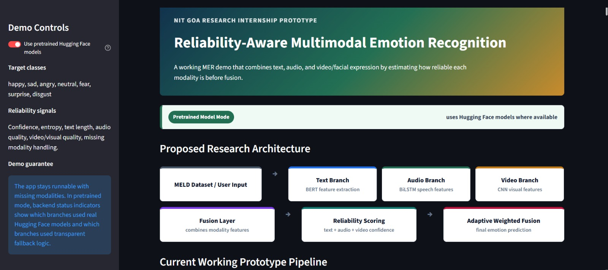
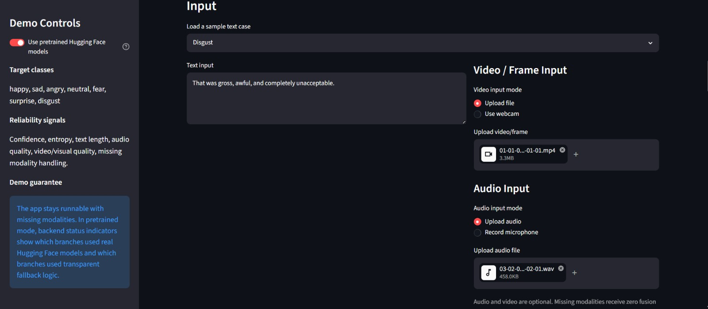
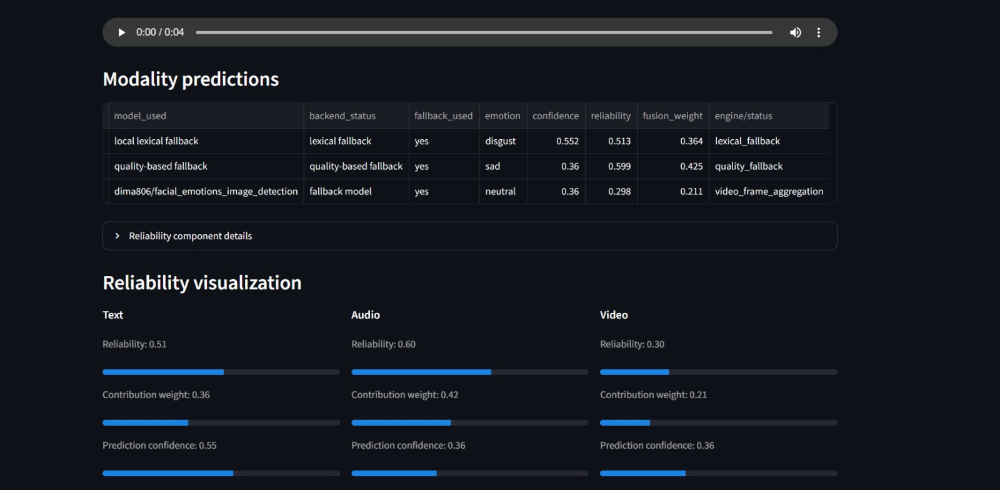
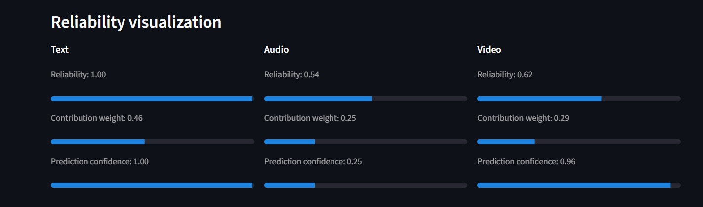
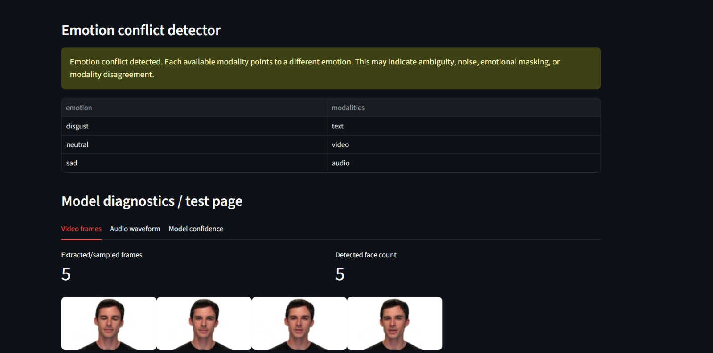
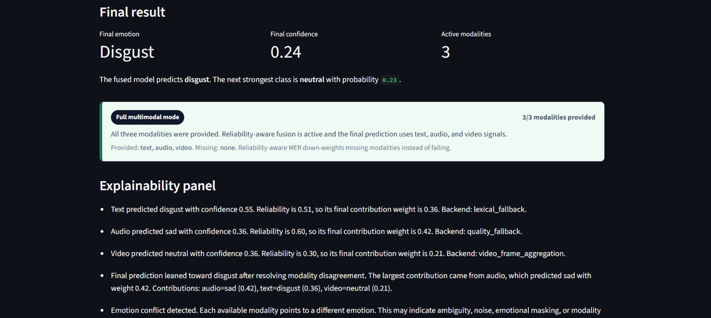
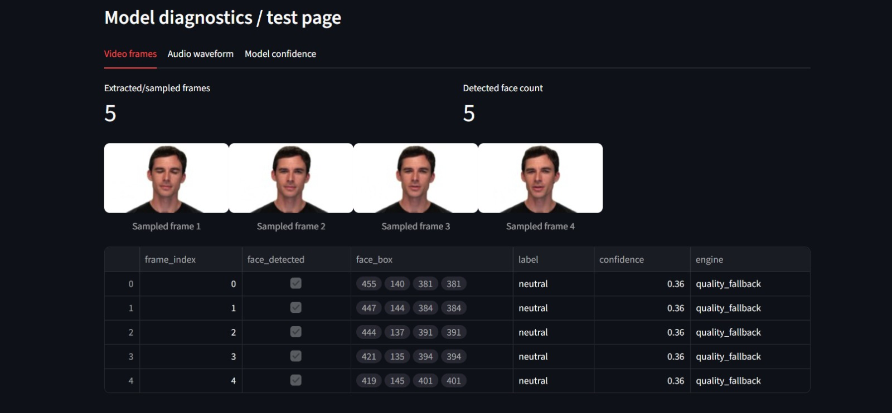
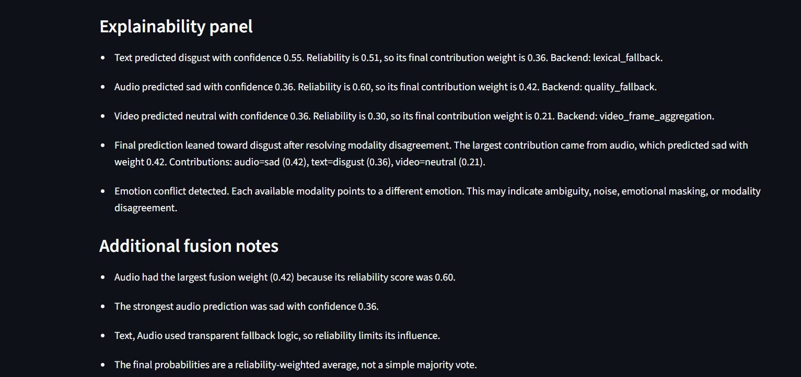

# 🧠 Reliability-Aware Multimodal Emotion Recognition

> ****Research Prototype developed during my Summer Research Internship at NIT Goa****

A research-oriented **Multimodal Emotion Recognition (MER)** system that combines **Text, Audio, and Facial Expressions** using **Reliability-Aware Adaptive Fusion** to improve prediction robustness, handle conflicting modalities, and provide explainable emotion predictions.


[](https://reliability-aware-mer.streamlit.app)
[](https://github.com/Shraddha-Verma1203/Reliability-Aware-Multimodal-Emotion-Recognition)

---
## 📌 Project Highlights

- 🎓 Developed during **Summer Research Internship at NIT Goa**
- 🧠 Reliability-Aware Adaptive Fusion for Multimodal Emotion Recognition
- 🎤 Supports **Text, Audio & Facial Expression** analysis
- ⚖️ Dynamic reliability scoring for each modality
- 🔍 Explainable AI with confidence visualization
- ⚠️ Cross-modal conflict detection
- 🌐 Live interactive Streamlit web application
- 🤗 Hugging Face model integration

## 🔄 Workflow

```text
User Input
      │
      ▼
Text + Audio + Video Processing
      │
      ▼
Feature Extraction
(BERT • Wav2Vec2 • CNN)
      │
      ▼
Reliability Estimation
      │
      ▼
Adaptive Weighted Fusion
      │
      ▼
Conflict Detection
      │
      ▼
Explainable Emotion Prediction
```

## 📷 Application Preview

### 🏠 Home Page

<p align="center">
  
</p>

---

### 📥 Input & Modalities

<p align="center">
  
</p>

---

### 🎭 Emotion Prediction & Reliability Visualization

<p align="center">
  
</p>

---

### 📊 Reliability Visualization

<p align="center">
  
</p>

---

### ⚠️ Conflict Detection

<p align="center">
  
</p>

---

### 💡 Explainability Panel

<p align="center">
  
</p>

---

### 🏆 Final Weighted Fusion Result

<p align="center">
  
</p>

---

### ✅ Final Emotion Prediction

<p align="center">
  
</p>

<p align="center">
  
</p>

---

### 📈 Research Metrics Dashboard

<p align="center">
  
</p>

---

### 🧪 Model Diagnostics

<p align="center">
  
</p>

---

### 📝 Additional Fusion Notes

<p align="center">
  
</p>

## 🛠 Tech Stack

| Category | Technologies |
|----------|--------------|
| Programming | Python 3.12 |
| Web App | Streamlit |
| Deep Learning | PyTorch |
| NLP | BERT, Hugging Face Transformers |
| Speech Processing | Wav2Vec2 |
| Computer Vision | OpenCV, CNN |
| ML Utilities| Scikit-learn |
| Data Processing | Pandas, NumPy |
| Version Control | Git,Github |

## 🎓 Research Contribution

This project was developed during my **Summer Research Internship at NIT Goa** as a research prototype for **Reliability-Aware Multimodal Emotion Recognition**.

### Key Contributions

- Proposed Reliability-Aware Adaptive Fusion
- Designed Dynamic Modality Weighting
- Implemented Cross-modal Conflict Detection
- Added Explainability Module
- Improved Missing Modality Handling

## 🎯 Project Outcomes

- ✅ Interactive Streamlit web application
- ✅ End-to-end multimodal inference pipeline
- ✅ Reliability-aware adaptive fusion
- ✅ Explainable AI dashboard
- ✅ Cross-modal conflict detection
- ✅ Supports Text, Audio and Video inputs
- ✅ Successfully deployed on Streamlit Community Cloud

## Project Goal

This project upgrades a basic emotion prediction demo into a
**Reliability-Aware Multimodal Emotion Recognition (MER)** system. It accepts
text, audio, and video/frame input, predicts emotion for each available
modality, estimates how reliable each modality is, detects cross-modal conflict,
and produces an explainable final prediction through adaptive weighted fusion.

Target emotion classes:

`happy`, `sad`, `angry`, `neutral`, `fear`, `surprise`, `disgust`

## Research Problem Statement

Existing Problem:

- Simple averaging ignores unreliable modalities.
- Missing modalities reduce system usability.
- Different modalities may contradict each other.
- Most MER systems lack explanation.

Proposed Solution:

- Reliability-aware fusion.
- Dynamic modality weighting.
- Missing modality robustness.
- Conflict detection.
- Explainable prediction output.

## System Architecture

```text
Input
  |
  +--> Text Encoder
  +--> Audio Encoder
  +--> Video Encoder
          |
          v
Reliability Estimator
          |
          v
Dynamic Fusion Engine
          |
          v
Conflict Detector
          |
          v
Final Emotion Prediction
          |
          v
Explainability Output
```

## Proposed Research Architecture

```text
MELD Dataset / User Input
        |
        v
Text Branch       Audio Branch        Video Branch
BERT              BiLSTM              CNN
text features     speech features     facial/visual features
        \             |              /
         \            |             /
          v           v            v
              Fusion Layer
                  |
                  v
        Reliability Scoring Module
        - text reliability
        - audio reliability
        - video reliability
                  |
                  v
        Adaptive Weighted Fusion
                  |
                  v
        Final Emotion Prediction
```

## Current Working Prototype Pipeline

- **Prototype Mode** uses fallback/demo logic.
- **Pretrained Model Mode** uses Hugging Face models where available.
- Backend status indicators show whether each modality used a real model or fallback logic.
- Uploaded MP4/AVI/MOV videos are processed as videos: frames are sampled for the
  visual branch, and the audio track is extracted for the audio branch when no
  separate audio upload is provided.
- BiLSTM and custom CNN are proposed research components; current implementation
  uses pretrained/fallback models unless custom trained checkpoints are added.

## Implemented Research Features

1. **Reliability-Aware Fusion**
   Each modality has a predicted emotion, confidence score, reliability score,
   and final contribution weight. Fusion uses:

   ```text
   final_score = sum(modality_score x reliability_weight)
   ```

2. **Missing Modality Handling**
   The app works with text only, audio only, video only, any pair, or all three.
   Missing modalities receive fusion weight `0`, and available modalities are
   re-weighted.

3. **Explainability Panel**
   The app explains text, audio, video, and fusion decisions in plain language.

4. **Emotion Conflict Detector**
   If modalities disagree, the app shows a warning describing the conflict and
   possible emotional masking or modality disagreement.

5. **Live Input Support**
   The UI supports file upload, webcam frame capture through `st.camera_input`,
   and microphone recording through Streamlit audio input when available.

6. **Reliability Visualization**
   The UI shows progress bars for reliability, contribution weight, and
   confidence for text/audio/video.

7. **Research Metrics Page**
   The app includes demo/example metrics: accuracy, precision, recall, F1-score,
   and confusion matrix. Real MELD/project metrics can be added through a
   manifest later.

8. **Model Diagnostics / Test Page**
   After prediction, the app shows sampled video frames, detected face count,
   extracted audio waveform, and model confidence scores.

## Algorithms Used

- **Text: BERT / Transformer text classifier**
  Pretrained mode uses a Hugging Face Transformer classifier. Prototype mode uses
  a local lexical fallback for offline demos.
- **Audio: Wav2Vec2 audio emotion classifier OR BiLSTM placeholder**
  Current implementation can use a Hugging Face audio classifier over uploaded
  audio or audio extracted from video; custom BiLSTM checkpoints are not yet included.
- **Video: CNN-based facial emotion classifier OR image-classification model**
  Current implementation detects faces in uploaded images or sampled video
  frames, runs a pretrained image-classification model when available, and
  aggregates frame-level video predictions.
- **Reliability Scoring**
  Confidence and quality checking for every modality.
- **Fusion: Reliability-aware adaptive weighted fusion**
  Final prediction uses reliability-weighted modality scores.

## 👩‍💻 Author

**Shraddha Verma**

B.Tech Computer Science Engineering

Summer Research Intern — NIT Goa

- LinkedIn: https://www.linkedin.com/in/shraddha-verma-52175031b/
- GitHub: https://github.com/Shraddha-Verma1203
